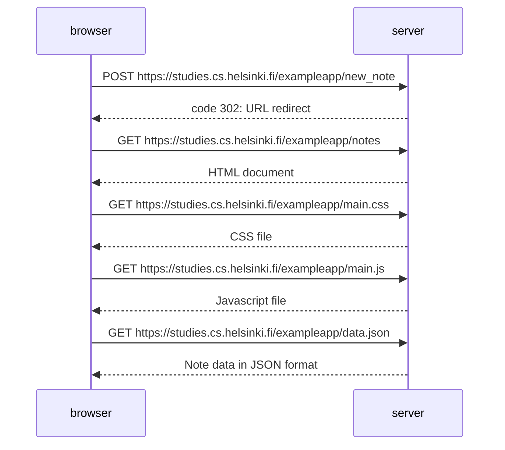

```mermaid
sequenceDiagram
    participant browser
    participant server

    browser ->> server: POST https://studies.cs.helsinki.fi/exampleapp/new_note
    server -->> browser: code 302: URL redirect 
    browser ->> server: GET https://studies.cs.helsinki.fi/exampleapp/notes
    server -->> browser: HTML document
    browser ->> server: GET https://studies.cs.helsinki.fi/exampleapp/main.css
    server -->> browser: CSS file
    browser ->> server: GET https://studies.cs.helsinki.fi/exampleapp/main.js
    server -->> browser: Javascript file
    browser ->> server: GET https://studies.cs.helsinki.fi/exampleapp/data.json
    server -->> browser: Note data in JSON format
``` 