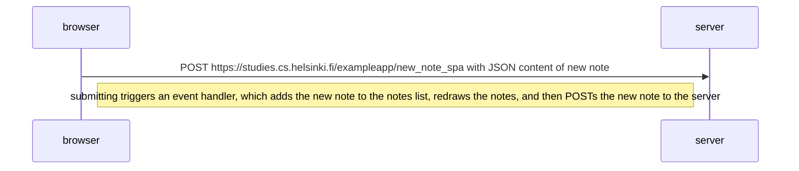

```mermaid
sequenceDiagram
    participant browser
    participant server

    browser ->> server: POST https://studies.cs.helsinki.fi/exampleapp/new_note_spa with JSON content of new note
    Note right of browser: submitting triggers an event handler, which adds the new note to the notes list, redraws the notes, and then POSTs the new note to the server
```